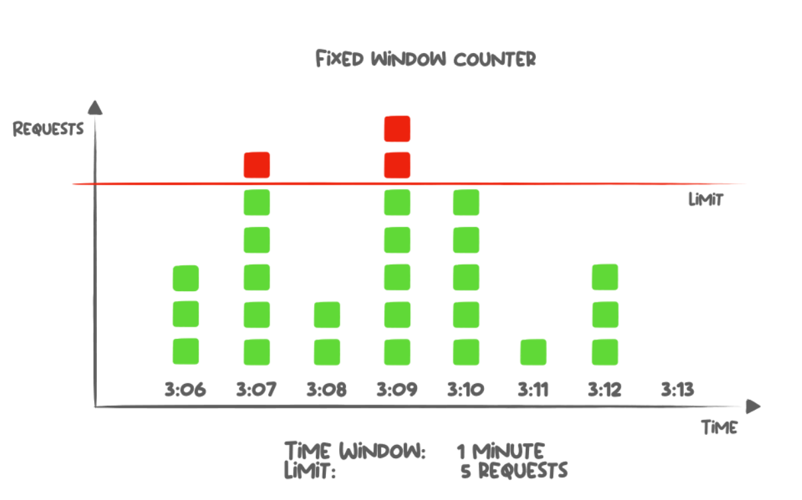
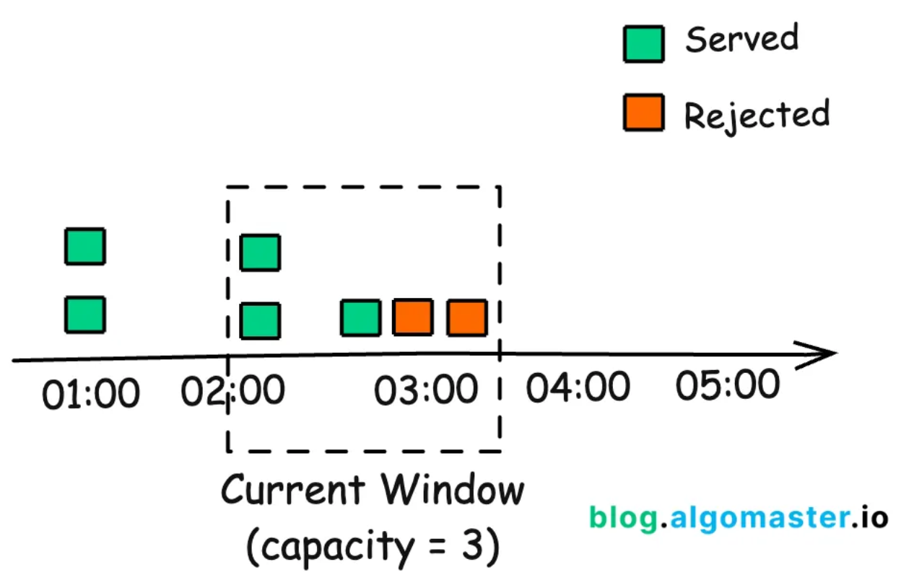
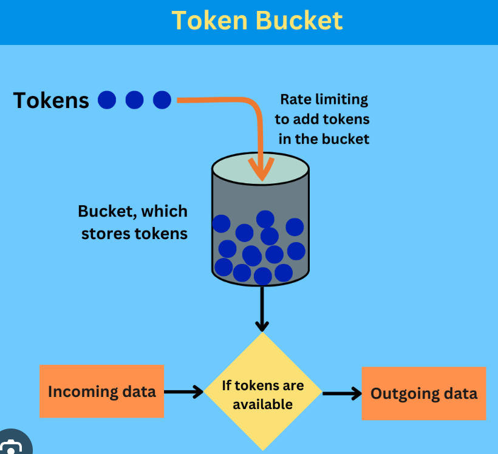
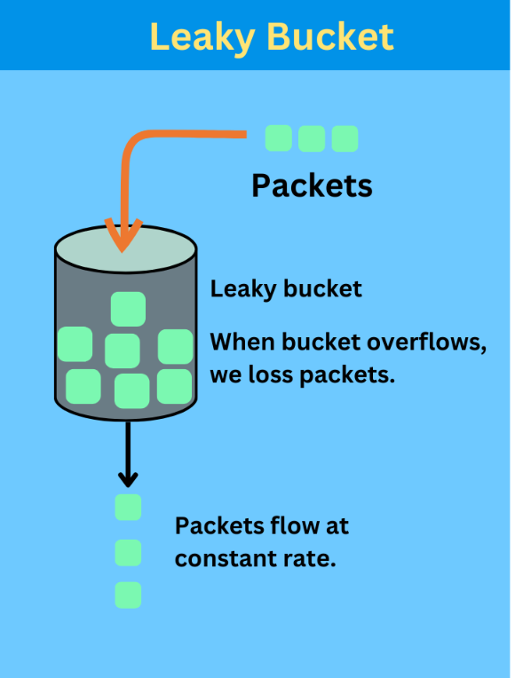

# Rate Limiter System Design Guide

## Table of Contents

1. [Problem Definition](#1-problem-definition)
2. [Requirements Analysis](#2-requirements-analysis)
   - 2.1 [Functional Requirements](#21-functional-requirements)
   - 2.2 [Non-Functional Requirements](#22-non-functional-requirements)
   - 2.3 [Scale Estimation](#23-scale-estimation)
3. [Placement & Identification Strategy](#3-placement--identification-strategy)
   - 3.1 [Where to Place the Rate Limiter?](#31-where-to-place-the-rate-limiter)
   - 3.2 [Client Identification Strategies](#32-client-identification-strategies)
4. [Rate Limiting Algorithms](#4-rate-limiting-algorithms)
   - 4.1 [Algorithm Comparison](#41-algorithm-comparison)
   - 4.2 [Fixed Window Counter](#42-fixed-window-counter)
   - 4.3 [Sliding Window Log](#43-sliding-window-log)
   - 4.4 [Sliding Window Counter](#44-sliding-window-counter)
   - 4.5 [Token Bucket](#45-token-bucket-recommended)
   - 4.6 [Leaky Bucket](#46-leaky-bucket-alternative)
5. [Core Entities & Interfaces](#5-core-entities--interfaces)
   - 5.1 [Core Entities](#51-core-entities)
   - 5.2 [System Interface](#52-system-interface)
6. [High-Level Design](#6-high-level-design)
   - 6.1 [Architecture Diagram](#61-architecture-diagram)
   - 6.2 [Request Flow](#62-request-flow)
7. [Response Headers & Status Codes](#7-response-headers--status-codes)
   - 7.1 [Success Response](#71-success-response-200-299)
   - 7.2 [Rate Limit Exceeded](#72-rate-limit-exceeded-429)
8. [Deep Dive: Scalability](#8-deep-dive-scalability)
   - 8.1 [Redis Bottleneck Analysis](#81-redis-bottleneck-analysis)
   - 8.2 [Sharding Strategy](#82-sharding-strategy)
   - 8.3 [Scaling Formula](#83-scaling-formula)
9. [Deep Dive: High Availability & Fault Tolerance](#9-deep-dive-high-availability--fault-tolerance)
   - 9.1 [Failure Modes](#91-failure-modes)
   - 9.2 [Fail-Open vs Fail-Closed](#92-fail-open-vs-fail-closed)
   - 9.3 [Replication for High Availability](#93-replication-for-high-availability)
10. [Deep Dive: Low Latency](#10-deep-dive-low-latency)
    - 10.1 [Latency Budget](#101-latency-budget)
    - 10.2 [Connection Pooling](#102-connection-pooling)
    - 10.3 [Geographic Distribution](#103-geographic-distribution)
11. [Deep Dive: Dynamic Configuration](#11-deep-dive-dynamic-configuration)
    - 11.1 [Configuration Requirements](#111-configuration-requirements)
    - 11.2 [Approaches to Config Management](#112-approaches-to-config-management)
    - 11.3 [Example: Zookeeper Watch](#113-example-zookeeper-watch)
12. [Implementation Details](#12-implementation-details)
    - 12.1 [Atomic Rate Limit Check (Lua Script)](#121-atomic-rate-limit-check-lua-script)
    - 12.2 [Redis Commands](#122-redis-commands)
13. [Candidate Evaluation Rubric](#13-candidate-evaluation-rubric)
14. [Common Interview Questions & Answers](#14-common-interview-questions--answers)
15. [Summary & Decision Tree](#15-summary--decision-tree)
16. [References & Further Reading](#16-references--further-reading)

---

## 1. Problem Definition

### What is a Rate Limiter?
A rate limiter controls the number of requests a client can make within a specific time frame, protecting backend services from abuse, overload, and cascading failures.

**Example:** A social media app might limit users to 100 requests per minute to prevent spam and ensure fair resource allocation.

---

## 2. Requirements Analysis

### 2.1 Functional Requirements

| Requirement | Details |
|-------------|---------|
| **Identify Clients** | Recognize users by ID, IP address, or API key to track their request quotas |
| **Limit Requests** | Enforce configurable rules (e.g., 100 requests/minute per user) for specific endpoints |
| **Return Proper Responses** | Send HTTP 429 (Too Many Requests) with metadata headers for failed requests |

### 2.2 Non-Functional Requirements

| Requirement | Target | Why It Matters |
|-------------|--------|-----------------|
| **Scalability** | 1M requests/second (100M DAU) | Must handle production traffic patterns |
| **Low Latency** | <10ms per rate limit check | Minimize impact on user request latency |
| **High Availability** | Favor availability over consistency (CAP theorem) | System must remain operational during outages |
| **Fault Tolerance** | Graceful degradation on failures | Component failures shouldn't cascade |

### 2.3 Scale Estimation

**Assuming a social media platform:**
- 100 million daily active users
- Average requests per user per day: ~10
- Total daily requests: 1 billion
- **Peak QPS: ~1 million requests/second** (accounting for uneven distribution)

---

## 3. Placement & Identification Strategy

### 3.1 Where to Place the Rate Limiter?

Three options with tradeoffs:

#### Option 1: Inside Each Microservice ❌
```
Client → Gateway → Microservice (with rate limiter)
                 → Microservice (with rate limiter)
```
- **Pros:** Ultra-fast (in-memory, no network calls)
- **Cons:** No global view; user can bypass limits by hitting different services
- **Verdict:** Poor choice for production

#### Option 2: Dedicated Rate Limiter Service ⚠️
```
Client → Gateway → Rate Limiter Service ↔ Microservices
```
- **Pros:** Global coordination of limits
- **Cons:** Extra network latency on every request
- **Verdict:** Works but not optimal for sub-10ms requirement

#### Option 3: At the Edge (API Gateway/Load Balancer) ✅ **RECOMMENDED**
```
Client → [API Gateway + Rate Limiter] → Microservices
              ↓
           Redis Cache
```
- **Pros:** First line of defense; minimal latency; blocks bad actors before they enter
- **Cons:** Limited context (only HTTP headers, auth tokens, IP)
- **Verdict:** Used in most production systems; resembles a bouncer at a club

### 3.2 Client Identification Strategies

**Single Identifier Approaches:**
- User ID (authenticated users)
- IP Address (public/anonymous users)
- API Key (developer tools)

**Best Practice: Layered Approach** (most realistic)
```
Priority 1: User ID (highest limit, e.g., 1000 req/sec)
Priority 2: API Key (medium limit, e.g., 500 req/sec)
Priority 3: IP Address (lowest limit, e.g., 100 req/sec)

Additional: Premium users get 10x higher limits
```

**Extraction from Requests:**
- JWT tokens in Authorization headers
- Query parameters or custom headers
- IP address from connection metadata

---

## 4. Rate Limiting Algorithms

There are several different rate limiting algorithms, but five are particularly worth knowing for system design interviews. Each has distinct trade-offs between accuracy, memory usage, burst handling, and implementation complexity. Below we compare them and explore each in detail.

### 4.1 Algorithm Comparison

| Algorithm | Memory | Accuracy | Burst Handling | Distributed Friendly | Complexity | Use Case | Interview Rating |
|-----------|--------|----------|----------------|----------------------|-----------|----------|-----------------|
| **Fixed Window Counter** | Very Low | Poor | Bad (boundary effect) | Easy | O(1) | Learning/simple systems | ★★★ |
| **Sliding Window Log** | High | Perfect | Excellent | Expensive | O(N) | Not recommended (memory) | ★★★ |
| **Sliding Window Counter** | Low | High | Good | Good | O(1) | Hybrid approach | ★★★★★ |
| **Token Bucket** | Very Low | High | Excellent | Excellent | O(1) | **RECOMMENDED** | ★★★★★ |
| **Leaky Bucket** | Very Low | High | Smooth only | Excellent | O(1) | Rate smoothing | ★★★★ |

### 4.2 Fixed Window Counter ❌

**Concept:** Divide time into fixed windows (e.g., 1-minute intervals). Each user gets N requests per window.

```
Window 1 (12:00-12:01): [req1, req2, req3] ✓
Window 2 (12:01-12:02): [req1, req2, req3] ✓
Boundary Issue: User can make 3 at 12:00:59 + 3 at 12:01:00 = 6 in 2 seconds!
```



**Storage:**
```
Hash Table:
{
  "alice": {"12:00": 100, "12:01": 5},
  "bob": {"12:00": 50},
  ...
}
```

**Issues:**
- **Boundary Effect:** Spike at window boundaries
- **Starvation:** If you exhaust quota at window start, wait entire window
- **Verdict:** Poor for production

### 4.3 Sliding Window Log ⚠️

**Concept:** Keep a log of exact timestamps of all requests in the past N minutes. Allow only if count < limit.

```
Current time: 12:05:30
Window: Last 60 seconds
Requests in window: [12:04:40, 12:05:10, 12:05:15, 12:05:25]
Count = 4, Limit = 100 → ALLOW
```

**Storage:**
```
{
  "alice": [12:04:40, 12:05:10, 12:05:15, 12:05:25, ...],
  "bob": [12:03:20, 12:04:50, ...],
  ...
}
```

**Pros:**
- Perfect accuracy
- No boundary issues

**Cons:**
- **Memory intensive:** O(N) per user where N = requests in window
- At 1M RPS with 1-minute window = millions of entries in memory
- Expensive cleanup (removing old timestamps)
- **Verdict:** Not practical for production scale

### 4.4 Sliding Window Counter ✓ (Hybrid)

**Concept:** Track only 2 counters (previous + current window) and estimate sliding window.

```
Previous window (12:04): 8 requests
Current window (12:05): 6 requests (20 seconds into window, 70% complete)

Formula: 
current_requests + (previous_requests × percentage_remaining)
= 6 + (8 × 0.30)
= 6 + 2.4
= 8.4 requests

Limit = 10 → ALLOW
```



**Storage:** Just 2 integers per user!

**Pros:**
- Memory efficient
- Better than fixed window

**Cons:**
- Approximation (assumes even distribution)
- Not perfect accuracy

**Verdict:** Good middle-ground option

### 4.5 Token Bucket ✓✓ **RECOMMENDED**

**Concept:** Each user has a bucket holding tokens. Tokens refill at steady rate. Each request consumes 1 token.

```
┌──────────────────────┐
│   Token Bucket       │
│  [●●●●●●●●●●...]    │  Capacity: 100 tokens
│                      │  Refill rate: 10 tokens/min
└──────────────────────┘
        ↓ (consume 1 per request)
```



**Two Key Parameters:**

1. **Bucket Capacity:** Maximum burst size
   - If capacity = 100, can handle burst of 100 requests immediately
   
2. **Refill Rate:** Steady-state throughput
   - If refill = 10 tokens/minute, can sustain 10 req/min long-term

**Example:**
```
Bucket Capacity: 100 tokens
Refill Rate: 10 tokens/minute (1 token every 6 seconds)

Scenario A (Burst):
- Time 0: 100 tokens, 100 requests arrive → ALLOW all
- Time 0: 0 tokens left
- Time 6s: 1 token added, 1 request → ALLOW
- Time 12s: 1 token added, 1 request → ALLOW
- ...

Scenario B (Sustained Load):
- Every 6 seconds: 1 token added, 1 request → Long-term rate
```

**Storage per user:** 2 values
```
{
  "alice": {
    "tokens": 87,
    "last_refill_time": "2024-01-15T10:05:30Z"
  }
}
```

**Algorithm Logic:**
```
1. Fetch current tokens and last_refill_time from storage
2. Calculate elapsed time since last refill
3. Add tokens: elapsed_time × refill_rate
4. Cap at bucket capacity
5. If tokens > 0:
   - Decrement by 1
   - Update storage
   - ALLOW request
   Else:
   - REJECT request (429)
```

**Pros:**
- Excellent burst handling
- Simple to implement (2 values per user)
- Steady-state rate control
- Industry standard (AWS, Stripe, etc.)

**Cons:**
- Need to choose right capacity and refill rate
- Cold start issues (new users start with full bucket)

**Verdict:** Best choice for production

### 4.6 Leaky Bucket ✓ (Alternative)

**Concept:** Requests flow into a bucket at a variable rate and leak out at a constant rate. Like a bucket with a small hole at the bottom draining at fixed speed.

```
Incoming Requests
       ↓↓↓↓↓↓↓
   ┌─────────────┐
   │   Bucket    │  Capacity: 100 requests
   │  (Queue)    │  Leak rate: 10 req/second
   └──────┬──────┘
          ↓ (constant drip)
    Processed Requests
```



**Two Key Parameters:**

1. **Bucket Capacity:** Maximum queue size
   - If capacity = 100, queue holds up to 100 requests
   
2. **Leak Rate:** Steady outflow rate
   - If leak = 10 requests/second, exactly 10 req/sec are processed

**Example:**
```
Bucket Capacity: 100 requests
Leak Rate: 10 requests per second

Scenario A (Burst):
- Time 0: 50 requests arrive → queue 50 (bucket not full)
- Time 0.1s: Process 1 → queue 49
- Time 0.2s: 50 more requests arrive → queue 99 (near capacity)
- Time 0.3s: 10 requests arrive → queue 99 (REJECT 10, bucket full)

Scenario B (Sustained Load):
- Every 0.1s: 1 request leaves at fixed rate
- Long-term throughput: Exactly 10 req/sec (steady)
```

**Storage per user:** 2 values
```
{
  "alice": {
    "queue_size": 45,
    "last_leak_time": "2024-01-15T10:05:30Z"
  }
}
```

**Algorithm Logic:**
```
1. Fetch queue_size and last_leak_time from storage
2. Calculate elapsed time since last leak
3. Process requests: queue_size -= (elapsed_time × leak_rate)
4. If queue_size < 0: set to 0
5. If queue_size < capacity:
   - Add new request to queue
   - Increment queue_size
   - ALLOW request
   Else:
   - REJECT request (429)
6. Update storage with new queue_size and current time
```

**Pros:**
- **Smooth, predictable rate:** Constant output rate prevents spikes
- **Simple to implement:** 2 values per user
- **Fair distribution:** Requests processed in FIFO order
- **Excellent for distributed systems:** Works well across multiple instances

**Cons:**
- **No burst handling:** Can only process at fixed leak rate
  - User with burst of 100 requests might wait 10 seconds for all to process
  - Especially bad for interactive applications (poor user experience)
- **Requires active background job:** Leak must happen periodically
  - Unlike token bucket (passive), leaky bucket needs active worker threads
  - More operational overhead
- **Less intuitive:** Harder to understand "leak rate" than "tokens"

**Comparison with Token Bucket:**

| Aspect | Token Bucket | Leaky Bucket |
|--------|--------------|--------------|
| **Burst Handling** | Allows bursts up to bucket capacity | No bursts; smooth only |
| **Rate Control** | Tokens added on demand | Requests processed at fixed rate |
| **Queue Behavior** | Requests allowed immediately (if tokens) | Requests queued and processed FIFO |
| **User Experience** | Better (instant gratification) | Worse (must wait in queue) |
| **Implementation** | Simpler (passive) | More complex (active leak job) |
| **Best For** | APIs, user-facing apps | Background jobs, batch processing |

**Verdict:** Not recommended for most interviews; mention only if asked about alternatives. Token Bucket is superior for interactive systems.

---

## 5. Core Entities & Interfaces

### 5.1 Core Entities

```
Request {
  client_id: string          // user ID, IP, or API key
  endpoint: string           // which endpoint is being accessed
  timestamp: int64           // request timestamp
}

Client {
  id: string                 // user ID, IP address, or API key
  tier: enum                 // free, premium, enterprise
  limits: RateLimit[]        // applicable rate limit rules
}

Rule {
  client_type: string        // "user_id", "ip_address", "api_key"
  quota: int                 // max requests
  window: int                // time window in seconds
  endpoint: string?          // optional: limit to specific endpoint
}
```

### 5.2 System Interface

The rate limiter exposes a single core function:

```
isAllowed(client_id: string, rule: Rule) -> Response

Returns:
{
  allowed: boolean,
  remaining_tokens: int,
  reset_time: timestamp,
  retry_after_ms: int?        // if rejected
}
```

**Note:** In practice, this is called via:
- RPC call from gateway to rate limiter service, OR
- In-process function in edge gateway

---

## 6. High-Level Design

### 6.1 Architecture Diagram

```
┌─────────────────────────────────────────────────────────────┐
│  Clients (Web, Mobile, API)                                 │
└────────────────────┬────────────────────────────────────────┘
                     │
                     ↓
┌─────────────────────────────────────────────────────────────┐
│  Load Balancer / API Gateway + Rate Limiter                 │
│  ┌──────────────────────────────────────────────────────┐  │
│  │ Rate Limiter Middleware                              │  │
│  │ 1. Extract client_id from request (JWT, IP, key)    │  │
│  │ 2. Query Redis for token bucket state               │  │
│  │ 3. Check if request allowed (Lua script atomic)    │  │
│  │ 4. Return 429 or forward to service                 │  │
│  └──────────────────────────────────────────────────────┘  │
└────────────┬───────────────────────────────────────────────┘
             │ (tokens, last_refill_time)
             ↓
┌─────────────────────────────────────────────────────────────┐
│  Redis Cluster (Distributed Cache)                          │
│  ┌─────────────┐  ┌─────────────┐  ┌─────────────┐        │
│  │  Shard 1    │  │  Shard 2    │  │  Shard N    │        │
│  │ (w/ replica)│  │ (w/ replica)│  │ (w/ replica)│        │
│  └─────────────┘  └─────────────┘  └─────────────┘        │
│  ▼ (hashing: client_id → shard)                            │
└─────────────────────────────────────────────────────────────┘
             │
             ↓
┌─────────────────────────────────────────────────────────────┐
│  Zookeeper / Consul (Config Management)                     │
│  Stores and pushes rule updates to gateways                 │
└─────────────────────────────────────────────────────────────┘
             │
             ↓
┌─────────────────────────────────────────────────────────────┐
│  Microservices (Social Media, E-commerce, etc.)             │
│  ┌──────────────┐  ┌──────────────┐  ┌──────────────┐      │
│  │  Post Service│  │ Feed Service │  │ Comment API  │      │
│  └──────────────┘  └──────────────┘  └──────────────┘      │
└─────────────────────────────────────────────────────────────┘
```

### 6.2 Request Flow

```
1. Request arrives at API Gateway
   ↓
2. Rate Limiter middleware intercepts
   ↓
3. Extract client identifier from:
   - JWT token → user_id
   - HTTP header → API key
   - Connection → IP address
   ↓
4. Determine applicable rules from cache (Zookeeper)
   - Check if premium vs free user
   - Check endpoint-specific limits
   ↓
5. Atomic check with Redis:
   a) Fetch current tokens + last_refill_time
   b) Calculate new token count
   c) If tokens > 0: decrement and allow
      Else: reject with 429
   ↓
6. Return response:
   ✓ Forward to microservice
   ✗ Return 429 with headers
```

---

## 7. Response Headers & Status Codes

### 7.1 Success Response (200-299)

Request is allowed; proceed normally.

```
HTTP 200 OK
X-RateLimit-Limit: 100
X-RateLimit-Remaining: 45
X-RateLimit-Reset: 1705322400
```

### 7.2 Rate Limit Exceeded (429)

```
HTTP 429 Too Many Requests
X-RateLimit-Limit: 100
X-RateLimit-Remaining: 0
X-RateLimit-Reset: 1705322400
Retry-After: 47

Body:
{
  "error": "rate_limit_exceeded",
  "message": "You have exceeded your rate limit",
  "retry_after_seconds": 47
}
```

**Header Reference:**
- **X-RateLimit-Limit:** Total quota (requests per window)
- **X-RateLimit-Remaining:** Requests left in current window
- **X-RateLimit-Reset:** Unix timestamp when counter resets
- **Retry-After:** Seconds to wait before retrying

**Note:** Exact header names vary by system; the key is documenting what you're returning.

---

## 8. Deep Dive: Scalability

### 8.1 Redis Bottleneck Analysis

**Single Redis Instance Capacity:**
- ~100,000 operations/second (read + write combined)
- We need 1,000,000 requests/second
- Each rate limit check = 2 operations (HMGET + HSET)
- **Effective throughput: ~50,000 RPS per instance**

**Gap:** 1,000,000 RPS ÷ 50,000 RPS/instance = **Need 20 instances minimum**

(Add buffer for overhead: **25-30 Redis instances**)

### 8.2 Sharding Strategy

**Problem:** Can't replicate all data everywhere (memory limits). Must partition.

**Solution:** Consistent Hashing or Hash Slots

```
Shard Assignment (Hash Slots approach):
- Redis Cluster: 16,384 hash slots
- User "alice" → hash(alice) mod 16384 = slot 5234 → Shard 3
- User "bob" → hash(bob) mod 16384 = slot 8888 → Shard 7

API Gateway:
1. Parse client_id from request
2. Determine shard: shard = hash(client_id) / (16384 / num_shards)
3. Query appropriate Redis shard
4. Update in-place atomically
```

**Redis Cluster Benefits:**
- Automatic sharding via hash slots
- Built-in failover and replication
- Gateway client handles routing automatically

### 8.3 Scaling Formula

```
Required Instances = (Target RPS × 2 ops per check) / Avg Throughput per instance
                   + (10% overhead buffer)
                   + (Replication factor)

Example:
= (1,000,000 × 2) / 50,000 + 10% + (1 replica per shard)
= 40 + 4 + 40
= ~85 Redis instances total (40 primary + 40 replica + 5 extra)
```

---

## 9. Deep Dive: High Availability & Fault Tolerance

### 9.1 Failure Modes

| Failure | Impact | Resolution |
|---------|--------|------------|
| Redis shard down | Can't rate limit for those clients | Failover to replica |
| All Redis down | Can't rate limit anyone | Fail open or fail closed |
| Rate limiter service crashed | All requests bypass rate limiting | Restart service, monitor health |
| Configuration update fails | Old rules stuck in gateway memory | Graceful degradation |

### 9.2 Fail-Open vs Fail-Closed

**Fail-Open:** When rate limiter fails, allow all requests ⚠️

```
Pros: Users keep working
Cons: Backend services exposed to overload → cascading failures

Risk: 
  - Database gets hammered
  - Cache eviction storms
  - Microservices CPU maxes out
  - Entire system goes down
```

**Fail-Closed:** When rate limiter fails, reject all requests ❌

```
Pros: Backend protected from overload
Cons: Site appears down to users

Risk:
  - User-facing availability issue
  - Revenue impact
  - Bad reputation
```

**Best Practice: Graceful Degradation**

```
Normal Operation:
  Request → Redis rate limiter check → Microservice

Redis Down:
  Request → Local counter (fixed window in gateway RAM)
          → Microservice

Both Down:
  Request → Reject (429)
```

In-memory fallback uses local gateway memory (no coordination between gateways, but better than nothing while recovering).

### 9.3 Replication for High Availability

**Setup with Redis Cluster:**

```
Shard 1 (Primary)
  ├─ Replica 1A
  └─ Replica 1B

Shard 2 (Primary)
  ├─ Replica 2A
  └─ Replica 2B

...

Shard N (Primary)
  ├─ Replica NA
  └─ Replica NB
```

**Replication Strategy:**
- **Synchronous replication (Strong consistency):** Slow, wait for replicas to acknowledge
- **Asynchronous replication (High availability):** Fast, might lose some writes if primary dies

**Recommendation:** Asynchronous with 1-2 replicas
- We chose availability over consistency anyway
- Occasional lost data (user's token count off by 1) is acceptable
- Much higher throughput

**Failover Process:**
```
1. Primary dies
2. Health check detects failure
3. Replica promoted to primary in <100ms
4. Clients continue sending to new primary
5. Original primary replaced/recovered
```

---

## 10. Deep Dive: Low Latency

### 10.1 Latency Budget

**Target:** <10ms per rate limit check

**Breakdown:**
```
Request deserialization:      1ms
Extract client_id from JWT:   0.5ms
Redis HMGET (network):        2-4ms    ← Biggest component
Token calculation:            0.5ms
Redis HSET (network):         2-4ms    ← Biggest component
Response serialization:       1ms
──────────────────────────
Total:                        ~7-11ms
```

### 10.2 Connection Pooling

**Problem:** New TCP connection = 20-50ms latency overhead

```
Without pooling:
  TCP Handshake (SYN, SYN-ACK, ACK):  20-50ms
  TLS handshake (if HTTPS):           20-30ms
  Request/Response:                   2-4ms
  ───────────────────────────────────
  Total per request:                  42-84ms ❌

With connection pooling:
  Reuse existing connection:          2-4ms
  Request/Response:                   2-4ms
  ───────────────────────────────────
  Total per request:                  4-8ms ✓
```

**Implementation:**

Most Redis clients handle this automatically (Jedis, StackExchange.Redis, redis-py, etc.)

```java
// Example: Connection pool with Jedis (usually automatic)
JedisPoolConfig poolConfig = new JedisPoolConfig();
poolConfig.setMaxTotal(50);        // Max active connections
poolConfig.setMaxIdle(50);         // Max idle connections
poolConfig.setMinIdle(10);         // Min idle connections
poolConfig.setTestOnBorrow(true);  // Test connection on borrow

JedisPool pool = new JedisPool(poolConfig, "localhost", 6379);

// Use connection from pool
try (Jedis jedis = pool.getResource()) {
    jedis.hgetAll("alice");  // Operations use pooled connection
}
```

**Tuning Connection Pool Size:**
```
Pool Size = (Requests Per Second × Expected Response Time) / 1000

Example:
= (100,000 RPS × 5ms) / 1000
= 500 connections needed

Actual typical values: 50-100 for most systems
(Gateway doesn't send all requests simultaneously)
```

### 10.3 Geographic Distribution

**Problem:** User in Tokyo → Gateway in US = 100-200ms latency

**Solution:** Deploy rate limiter at multiple data centers

```
┌─────────────────────────┐
│  User in Tokyo          │
└────────────┬────────────┘
             │
    ┌────────┴─────────┐
    ↓                  ↓
┌─────────┐      ┌─────────┐
│Gateway  │      │Gateway  │
│+ Rate   │      │+ Rate   │
│Limiter  │      │Limiter  │
│(Tokyo)  │      │(Sydney) │
│Redis    │      │Redis    │
└─────────┘      └─────────┘
    ↓                  ↓
  5ms            70-80ms latency
```

**Cross-Region Sync:**
- Global counters sync via async replication (order matters less)
- Or partition traffic by region (each region has independent limits)
- Or use eventual consistency

---

## 11. Deep Dive: Dynamic Configuration

### 11.1 Configuration Requirements

Rate limiting rules must be dynamic because:
- Adjust limits during traffic spikes
- Different limits for premium vs free users
- Feature releases need different limits
- Security incidents need immediate rate limit changes

**Example Rules:**
```json
{
  "rules": [
    {
      "type": "user_id",
      "limit": 1000,
      "window_seconds": 60,
      "tier": "premium"
    },
    {
      "type": "user_id",
      "limit": 100,
      "window_seconds": 60,
      "tier": "free"
    },
    {
      "type": "ip_address",
      "limit": 50,
      "window_seconds": 60
    },
    {
      "type": "endpoint",
      "endpoint": "/api/expensive_operation",
      "limit": 10,
      "window_seconds": 60
    }
  ]
}
```

### 11.2 Approaches to Config Management

#### Approach 1: Pull-Based (Database) ❌
```
Gateway periodically queries database:
  Every 10 seconds: SELECT rules FROM rate_limit_config

Problems:
  - 10+ second delay to apply changes
  - Wasted CPU constantly polling
  - Extra load on database
```

#### Approach 2: Pull-Based (Redis) ⚠️
```
Gateway periodically queries Redis:
  Every request: GET rate_limit_rules

Problems:
  - Extra Redis operation per request
  - Adds 2-4ms latency (hurts our sub-10ms goal)
  - Rules might be stale for seconds
```

#### Approach 3: Push-Based (Zookeeper/Consul) ✓ **RECOMMENDED**
```
Configuration Service (Zookeeper/Consul):
  Stores authoritative rules
  
API Gateway:
  1. On startup: Fetch rules from Zookeeper
  2. Keep rules in local memory
  3. Subscribe to watch for changes
  4. When Zookeeper pushes update: Reload rules in memory
  
Update Flow:
  Admin changes rule in console
    ↓
  Config service updated
    ↓
  Zookeeper pushes to all subscribed gateways (via TCP)
    ↓
  Gateways update local memory (<100ms)
```

**Benefits:**
- No latency penalty (uses local memory)
- Near-real-time propagation
- No polling overhead
- Proven in production (Netflix, Uber, etc.)

### 11.3 Example: Zookeeper Watch

```java
import org.apache.zookeeper.ZooKeeper;
import org.apache.zookeeper.Watcher;
import org.apache.zookeeper.Watcher.Event.EventType;
import com.fasterxml.jackson.databind.ObjectMapper;
import java.util.*;

public class RateLimiterGateway {
    private ZooKeeper zkClient;
    private Map<String, RateLimit> rules;
    private final ObjectMapper objectMapper = new ObjectMapper();
    
    public RateLimiterGateway(ZooKeeper zkClient) throws Exception {
        this.zkClient = zkClient;
        this.rules = loadRules();
        
        // Subscribe to changes: watch will trigger on any update
        zkClient.exists("/rate_limiter/rules", event -> {
            if (event.getType() == EventType.NodeDataChanged) {
                try {
                    onRulesChanged();
                } catch (Exception e) {
                    logger.error("Failed to reload rules", e);
                }
                // Re-register watch for future changes
                zkClient.exists("/rate_limiter/rules", this::onRulesChanged);
            }
        });
    }
    
    private Map<String, RateLimit> loadRules() throws Exception {
        byte[] data = zkClient.getData("/rate_limiter/rules", false, null);
        String rulesJson = new String(data);
        return objectMapper.readValue(rulesJson, 
            new TypeReference<Map<String, RateLimit>>() {});
    }
    
    private void onRulesChanged(WatchedEvent event) {
        try {
            this.rules = loadRules();
            logger.info("Rules updated: {}", rules);
        } catch (Exception e) {
            logger.error("Error reloading rules", e);
        }
    }
    
    public boolean checkRateLimit(String clientId, String endpoint) {
        // Use this.rules (always fresh, no network call)
        List<RateLimit> applicableRules = findRules(clientId, endpoint);
        return checkTokens(clientId, applicableRules);
    }
    
    // Helper methods
    private List<RateLimit> findRules(String clientId, String endpoint) {
        // Implementation: filter rules by client and endpoint
        return new ArrayList<>();
    }
    
    private boolean checkTokens(String clientId, List<RateLimit> rules) {
        // Implementation: check token availability
        return true;
    }
}
```

---

## 12. Implementation Details

### 12.1 Atomic Rate Limit Check (Lua Script)

**Problem:** Race condition with separate HMGET + HSET

```
Timeline:
  Gateway A: HMGET alice → tokens: 10
  Gateway B: HMGET alice → tokens: 10
  Gateway A: Process, decrement → tokens: 9, HSET
  Gateway B: Process, decrement → tokens: 9, HSET
  Result: Both allowed, but should have been 8 remaining!
```

**Solution:** Lua Script (Atomic Transaction)

```lua
-- rate_limiter.lua
local key = KEYS[1]  -- client_id
local refill_rate = tonumber(ARGV[1])  -- tokens per second
local bucket_size = tonumber(ARGV[2])  -- max tokens
local now = tonumber(ARGV[3])  -- current timestamp

-- 1. Get current state
local current = redis.call('HMGET', key, 'tokens', 'last_refill')
local tokens = tonumber(current[1]) or bucket_size
local last_refill = tonumber(current[2]) or now

-- 2. Calculate refill
local elapsed = math.max(0, now - last_refill)
local new_tokens = math.min(bucket_size, tokens + elapsed * refill_rate)

-- 3. Check if allowed
local allowed = new_tokens > 0

-- 4. Update state
if allowed then
    redis.call('HSET', key, 'tokens', new_tokens - 1, 'last_refill', now)
else
    redis.call('HSET', key, 'tokens', new_tokens, 'last_refill', now)
end

-- 5. Return result
return {allowed and 1 or 0, math.ceil(new_tokens - 1), bucket_size}
```

**Execution in Java (Jedis):**
```java
// Load the Lua script
String luaScript = "... (script content from above) ...";

// Execute script atomically
try (Jedis jedis = pool.getResource()) {
    List<Long> result = (List<Long>) jedis.eval(
        luaScript,
        1,                                    // numKeys
        new String[]{"alice"},                // KEYS
        "10", "100", String.valueOf(System.currentTimeMillis() / 1000)  // ARGV
    );
    
    // Parse result: [allowed, remaining, limit]
    long allowed = result.get(0);             // 1 = allowed, 0 = rejected
    long remaining = result.get(1);           // 89 tokens remaining
    long limit = result.get(2);               // 100 token limit
    
    if (allowed == 1) {
        System.out.println("Request allowed. Remaining: " + remaining);
    } else {
        System.out.println("Rate limit exceeded");
    }
}
```

### 12.2 Redis Commands

**Typical operations:**

```redis
# Hash-based storage (per user)
HMGET alice tokens last_refill
HSET alice tokens 45 last_refill 1705322500

# Atomic operation
EVAL <lua_script> 1 alice 10 100 1705322500

# TTL to auto-cleanup stale entries
EXPIRE alice 3600  # Auto-delete if not accessed for 1 hour
```

---

## 13. Candidate Evaluation Rubric

### Mid-Level Candidate (80% Breadth, 20% Depth)
✓ Understands different rate limiting algorithms + trade-offs  
✓ Chooses token bucket and justifies decision  
✓ Places rate limiter at API gateway  
✓ Proposes Redis for global state sharing  
✓ Answers probing questions with reasonable solutions  
✓ Identifies single Redis bottleneck when asked  

### Senior Candidate (50% Breadth, 50% Depth)
✓ Everything above, PLUS proactively identifies:  
✓ Calculates 1M RPS → 20+ shards needed  
✓ Proposes Redis Cluster for sharding + failover  
✓ Discusses async replication + eventual consistency trade-off  
✓ Identifies race condition + Lua script solution  
✓ Proposes connection pooling for latency  
✓ Discusses fail-open vs fail-closed  
✓ Mentions Zookeeper for config management  

### Staff Candidate (30% Breadth, 70% Depth)
✓ Everything above, PLUS:  
✓ Deep Redis internals (single-threaded, event loop, memory management)  
✓ Real production incidents (e.g., Redis slot migration impact)  
✓ Benchmarking strategies and performance tuning  
✓ Advanced failure scenarios (split-brain, cascading failures)  
✓ Multi-region considerations and consistency models  
✓ Cost optimization (instance sizing, connection pooling tuning)  
✓ Monitoring and observability design  

---

## 14. Common Interview Questions & Answers

### Q1: "What if someone spoofs their IP address?"

**A:** IP-based rate limiting is best-effort. For critical rate limiting, rely on authenticated user IDs (JWT tokens). IP limits are secondary for unauthenticated traffic.

### Q2: "What happens when Redis Cluster rebalances?"

**A:** Hash slots migrate between nodes. This can cause brief connection resets, but clients automatically reconnect. Use Lua scripts to avoid partially applied changes. Monitor metrics during rebalancing.

### Q3: "How do you handle rate limit for POST vs GET?"

**A:** Different rules per endpoint:
```
GET /posts: 100 req/min
POST /posts: 10 req/min  (more expensive)
```
Extract endpoint from request URI, apply matching rule.

### Q4: "Can users coordinate to bypass limits?"

**A:** If coordinated across different IPs/user IDs:
- Per-user ID limits prevent same user from bypassing
- IP limits catch coordinated bot attacks
- Add additional checks (email domain, phone verification)

### Q5: "What's the minimum viable rate limiter?"

**A:** For interview:
- Single Redis instance
- Token bucket algorithm
- At API gateway
- JWT for user identification
- Basic failure handling

For production: Add the rest.

### Q6: "How do you test rate limiting?"

**A:**
```
Load Testing:
  - Generate 1M RPS traffic (simulation)
  - Verify 429 responses at correct thresholds
  - Measure latency (< 10ms)
  
Failure Testing:
  - Kill Redis → verify graceful degradation
  - Test race conditions (concurrent requests)
  - Test configuration updates
  
Monitoring:
  - Track success/reject ratio
  - Monitor Redis latency
  - Alert on anomalies
```

---

## 15. Summary & Decision Tree

```
Rate Limiting System Design Decision Flow:

1. Where to place?
   → At API Gateway/Load Balancer (edge)

2. What algorithm?
   → Token Bucket

3. How to store state?
   → Redis (in-memory cache)

4. Single instance?
   → No, shard at 20+ instances (Hash Slots/Cluster)

5. How to identify clients?
   → JWT (user_id) > API Key > IP Address (layered)

6. What if Redis fails?
   → Graceful degradation: local in-memory counter
   → Then fail-closed if both fail

7. For high availability?
   → 1-2 replicas per shard (async replication)
   → Health checks + automatic failover

8. For low latency?
   → Connection pooling (automatic in most clients)
   → Geographic co-location of gateway + Redis
   → Lua scripts for atomic operations

9. For dynamic config?
   → Zookeeper/Consul (push-based config)
   → Local cache in gateway memory

10. What to return on 429?
    → HTTP 429 status
    → X-RateLimit-* headers
    → Retry-After timestamp
```

---

## 16. References & Further Reading

**System Design Concepts:**
- CAP Theorem
- Consistent Hashing
- Redis Cluster documentation
- Zookeeper/Consul

**Algorithms:**
- Token Bucket (industry standard)
- Leaky Bucket (variant)
- Sliding Window (academic)

**Production Systems:**
- AWS API Gateway (throttling)
- Stripe API (rate limiting)
- GitHub API (rate limiting)
- Kong API Gateway (open source)

**Tools & Technologies:**
- Redis Cluster
- Consul
- Zookeeper
- Prometheus (monitoring)
- Grafana (visualization)

---

**Last Updated:** January 2024  
**Version:** 1.0  
**Format:** Comprehensive Interview Guide
