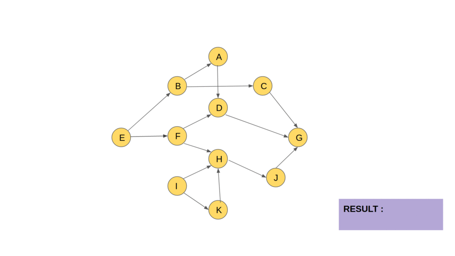

# Kahn's Algorithm — Topological Sort

Kahn's algorithm produces a topological order of a DAG using BFS: repeatedly
remove nodes with in-degree 0, and decrement the in-degree of their neighbors.

## Example graph

Edges:
- E → B, B → A, A → D
- B → C, C → G
- E → F, F → D, F → H
- D → G
- H → J, J → G
- I → H, I → K, K → H

## Step-by-step trace

| Step | Dequeued | Result so far | Newly unlocked (in-degree → 0) |
|------|----------|----------------------------------|----------------------------|
| 1 | E | E | B, F not yet — B: F still... |
| 1 | E | E | B |
| 2 | I | E, I | K |
| 3 | B | E, I, B | A, C |
| 4 | F | E, I, B, F | — |
| 5 | K | E, I, B, F, K | H |
| 6 | A | E, I, B, F, K, A | D |
| 7 | C | E, I, B, F, K, A, C | — |
| 8 | H | E, I, B, F, K, A, C, H | J |
| 9 | D | E, I, B, F, K, A, C, H, D | — |
| 10 | J | E, I, B, F, K, A, C, H, D, J | G |
| 11 | G | E, I, B, F, K, A, C, H, D, J, G | — |

**Final topological order:** `E, I, B, F, K, A, C, H, D, J, G`

## Java implementation

\`\`\`java
public List<Integer> topologicalSort(int n, List<List<Integer>> adj) {
int[] inDegree = new int[n];
for (int u = 0; u < n; u++)
for (int v : adj.get(u))
inDegree[v]++;

    Queue<Integer> queue = new LinkedList<>();
    for (int i = 0; i < n; i++)
        if (inDegree[i] == 0) queue.offer(i);

    List<Integer> result = new ArrayList<>();
    while (!queue.isEmpty()) {
        int u = queue.poll();
        result.add(u);
        for (int v : adj.get(u)) {
            if (--inDegree[v] == 0) queue.offer(v);
        }
    }

    if (result.size() != n) throw new IllegalStateException("Cycle detected");
    return result;
}
\`\`\`

## Python implementation

\`\`\`python
from collections import deque

def topological_sort(n, adj):
in_degree = [0] * n
for u in range(n):
for v in adj[u]:
in_degree[v] += 1

    queue = deque(i for i in range(n) if in_degree[i] == 0)
    result = []

    while queue:
        u = queue.popleft()
        result.append(u)
        for v in adj[u]:
            in_degree[v] -= 1
            if in_degree[v] == 0:
                queue.append(v)

    if len(result) != n:
        raise ValueError("Cycle detected")
    return result
\`\`\`

## Complexity

- **Time:** O(V + E)
- **Space:** O(V)

## Notes

- If `result.size() != n`, the graph has a cycle — Kahn's algorithm detects
  this automatically.
- Multiple valid topological orders can exist when more than one node has
  in-degree 0 at the same step (order depends on queue insertion order).